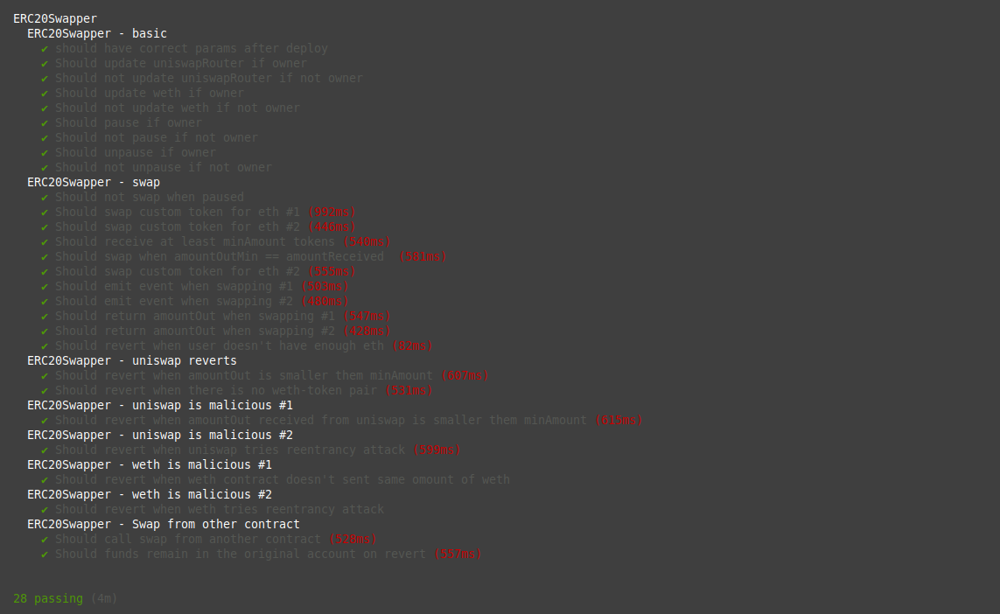
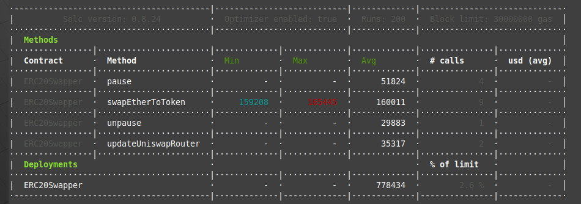
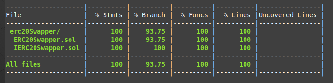

# ERC-20 swapping contract

The task is to create a simple Solidity contract for exchanging Ether to an arbitrary ERC-20.

## Requirements

1. Implement the following interface as a Solidity Contract

   ```solidity
   interface ERC20Swapper {
       /// @dev swaps the `msg.value` Ether to at least `minAmount` of tokens in `address`, or reverts
       /// @param token The address of ERC-20 token to swap
       /// @param minAmount The minimum amount of tokens transferred to msg.sender
       /// @return The actual amount of transferred tokens
       function swapEtherToToken(address token, uint minAmount) public payable returns (uint);
   }
   ```

2. Deploy the contract to a public Ethereum testnet (e.g. Sepolia)
3. Send the address of deployed contract and the source code to us

### Non-requirements

- Feel free to implement the contract by integrating to whatever DEX you feel comfortable - the exchange implementation is not required.

## Evaluation

Following properties of the contract implementation will be evaluated in this exercise:

- **Safety and trust minimization**. Are user's assets kept safe during the exchange transaction? Is the exchange rate fair and correct? Does the contract have an owner?
- **Performance**. How much gas will the `swapEtherToToken` execution and the deployment take?
- **Upgradeability**. How can the contract be updated if e.g. the DEX it uses has a critical vulnerability and/or the liquidity gets drained?
- **Usability and interoperability**. Is the contract usable for EOAs? Are other contracts able to interoperate with it?
- **Readability and code quality**. Are the code and design understandable and error-tolerant? Is the contract easily testable?


```shell
npx hardhat test
```



```shell
REPORT_GAS
```


```Erc20SwapperProxy + ProxyAdmin gas needed: 783,906```

```shell
npx hardhat test coverage
```



| Contract                     | Address (sepolia)                                                                                                             |                                    
|------------------------------|-------------------------------------------------------------------------------------------------------------------------------|
| `ProxyAdmin`                 | [0x1DEBaaBBE0027E1D7978fEC7F3711EB37c14c09E](https://sepolia.etherscan.io/address/0x1DEBaaBBE0027E1D7978fEC7F3711EB37c14c09E) |
| `ERC20SwapperProxy`          | [0x59cb8d2ED656b0991ED5390721A7a83b177f5BA8](https://sepolia.etherscan.io/address/0x59cb8d2ED656b0991ED5390721A7a83b177f5BA8) |
| `ERC20SwapperImplementation` | [0x5Ad70433Ba1a24BeBAf560699d82F9E715658a70](https://sepolia.etherscan.io/address/0x5Ad70433Ba1a24BeBAf560699d82F9E715658a70)                                                                                |
|
